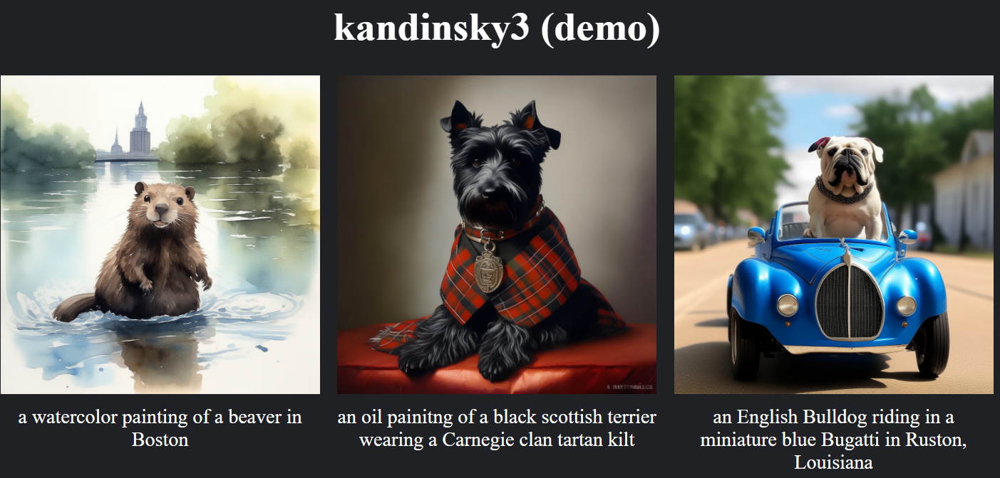

# Streamlined Bulk Diffusion Generation



## What is this?
In my research, I often found myself re-writing a new notebook every time I wanted to draw a bunch of samples from a new diffusion model.  

This is just a little tool I made to streamline the process. Given a `prompts` file, This repo will take your chosen `model` and generate a corresponding image for each prompt.

Nothing too special, I just wanted something easy (for me) to use. Hopefully it might be useful for someone else out there. 

I've also included a script to easily view your images in a web page.

## Setup
Please run the following to create a conda environment and install dependencies:
```bash
conda create -n easy-diffusion
conda activate easy-diffusion
conda install pip
pip install torch torchvision
pip install -r requirements.txt
```
You can then run `get_prompts.py` to download several popular prompt collections.

## Generation
You can generate images and save them in `./generated_images` with the following command
```bash
python gen.py --model=$MODEL --prompts=$PROMPTS --save_dir=./generated_images
```
For appropriate values of `$MODEL` and `$PROMPTS`, please run
```bash
python list_models.py
```
and
```bash
python list_prompts.py
```
respectively.

Adding `--skip_existing` will skip over prompts for which there already exists an image in the output directory.

Adding `--det_seed` will use a deterministic seed (equal to the index of the prompt) for reproducibility.

## Web Viewer
To create a simple HTML page to view your images, please run
```bash
python web_gen.py --root_dir=./generated_images
python -m http.server -d=./generated_images 1111
```

The HTTP server will then be viewable on port `1111`.

If you are on a local machine, you can navigate to [localhost:1111](http://localhost:1111).

